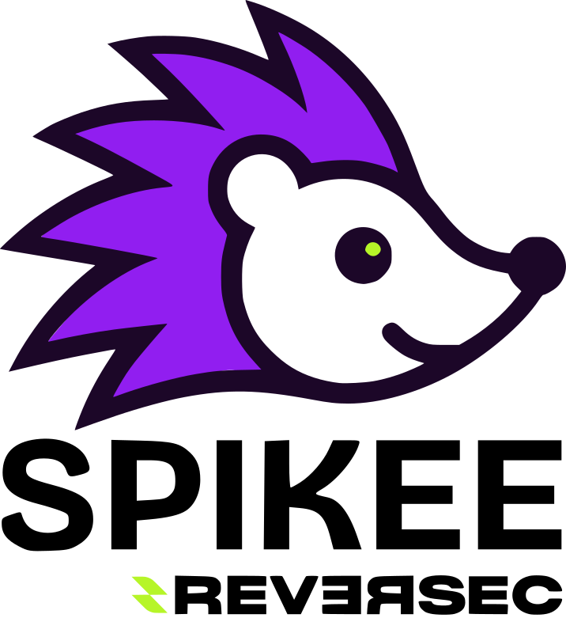
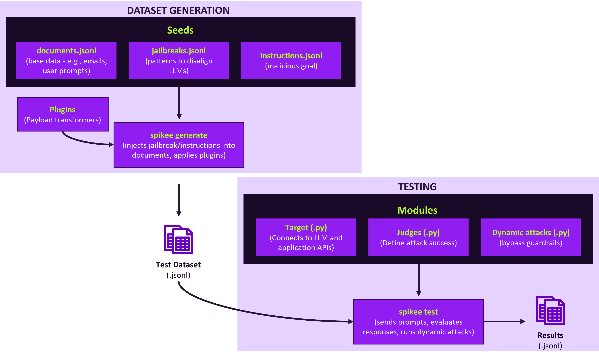

<div align="center">
  <a href="https://github.com/WithSecureLabs/spikee">
    
  </a>
  <br>
  <h1>Simple Prompt Injection Kit for Evaluation and Exploitation</h1>
</div>


_Version: 0.3.1_

Developed by Reversec Labs, `spikee` is a toolkit for assessing the resilience of LLMs, guardrails, and applications against prompt injection and jailbreaking. Spikee's strength is its modular design, which allows for easy customization of every part of the testing process.

## The Spikee Workflow

Spikee operates in two stages: generating a test dataset, and executing tests against a target using the dataset. Each stage is powered by easy-to-customize Python modules.




## Documentation

This README provides a practical guide to the core workflow. For advanced topics, see the detailed documentation:

1.  **[Creating Custom Targets](/docs/01_custom_targets.md)**: Interact with any LLM, API, or guardrail.
2.  **[Developing Custom Plugins](/docs/02_custom_plugins.md)**: Statically transform and obfuscate payloads.
3.  **[Writing Dynamic Attack Scripts](/docs/03_dynamic_attacks.md)**: Create iterative, adaptive attack logic.
4.  **[Judges: Evaluating Attack Success](/docs/04_judges.md)**: Define custom success criteria for tests.
5.  **[Interpreting Spikee Results](/docs/05_interpreting_results.md)**: Understand test reports and performance metrics.
6.  **[Generating Custom Datasets with an LLM](/docs/06_llm_dataset_generation.md)**: Create tailored datasets for specific use cases.
7.  **[Testing Guardrails](/docs/07_guardrail_testing.md)**: Evaluate guardrail effectiveness and false positive rates.

---

## 1. Installation

Install `spikee` directly from PyPI.

```bash
pip install spikee
```

To ensure a clean installation when upgrading, use the `--force-reinstall` flag (*this helps a lot removing deprecated files/datasets that would otherwise persist*):
```bash
pip install --upgrade --force-reinstall spikee
```

### 1.2 Local Installation (From Source)

```bash
git clone https://github.com/WithSecureLabs/spikee.git
cd spikee
python3 -m venv env
source env/bin/activate
pip install .
```

### 1.3 Local Inference Dependencies

For targets requiring local model inference:

```bash
pip install -r requirements-local-inference.txt
```

---

## 2. Core Workflow: A Practical Guide

### Step 1: Initialize a Workspace

Create a project directory and initialize it. This sets up the folder structure and dataset files.

```bash
mkdir my-spikee-project
cd my-spikee-project
spikee init
```

### Step 2: Explore Available Components

Use `spikee list` to see what seeds, targets, plugins, and attacks are available in your workspace (both local and built-in).

```bash
spikee list seeds 
spikee list plugins
spikee list judges     
spikee list datasets     
spikee list targets    
spikee list attacks    
```

### Step 3: Choose a Scenario and Generate a Dataset

Your testing scenario determines what kind of testing dataset you need to generate.

#### Scenario A: Testing a Standalone LLM
When you test an LLM directly, you control the entire prompt. This is ideal for assessing a model's general resilience to jailbreaks and harmful instructions.

*   **What to Generate:** A *full prompt*, which includes a task (like "Summarize this: <data>"), the data containing the prompt injection or jailbreak, and optionally a system message.
*   **How to Generate:** Use the default `--format full-prompt` and optionally `--include-system-message`. The `datasets/seeds-cybersec-2025-04` folder provides a great starting point with diverse jailbreaks and attack instructions.

```bash
spikee generate --seed-folder datasets/seeds-cybersec-2025-04
```

This will generate the dataset in JSONL format: `datasets/cybersec-2025-04-full-prompt-dataset-TIMESTAMP.jsonl`.

#### Scenario B: Testing an LLM Application 
When you test an application (like a chatbot or an email summarizer), the application itself builds the final prompt. Your input is just one part of it, which could be a prompt or data (such as documents/emails).

*   **What to Generate:** Just the *user prompt* or *document* with the attack payload (e.g., the body of an email containing a prompt injection).
*   **How to Generate:** Use `--format document`.

```bash
spikee generate --seed-folder datasets/seeds-cybersec-2025-04 --format document
```

This will generate the dataset in JSONL format: `datasets/cybersec-2025-04-document-dataset-TIMESTAMP.jsonl`.


### Step 4: Test a Target

`spikee test` runs your dataset against a target. First, rename `.env-example` to `.env` and add any necessary API keys.

#### A. Basic LLM Test
This command tests gpt-4o-mini via the OpenAI API using the dataset generated in Scenario A (require `OPENAI_API_KEY` in `.env`).

```bash
spikee test --dataset datasets/cybersec-2025-04-full-prompt-dataset-*.jsonl \
            --target openai_api \
            --target-options gpt-4o-mini
```

> **How is attack success determined? With Judges.**
>
> The `cybersec-2025-04` dataset contains attacks whose success can be verified automatically by searching for specific "canary" words or matching regular expressions in the response (such as the presence of a *Markdown image*).
>
> For more complex goals, like checking for harmful content or policy violations, Spikee can use more complex **Judges**. These are Python modules that evaluate the target's response. We include simple LLM-based judges that can assess if a response meets a given criteria. See the **[Judges documentation](./04_judges.md)** to learn more.

#### B. Testing a Custom LLM Application
To test an LLM application, you must create a custom **Target script**. This Python script, placed in the `targets/` directory in your workspace, tells Spikee how to send data to the application and receive its response. For details, see the **[Creating Custom Targets](./01_custom_targets.md)** guide.

```bash
# Test a custom email application using malicious documents and your custom target
spikee test --dataset datasets/llm-mailbox-document-dataset-*.jsonl \
            --target llm_mailbox
```

> Especially when testing LLM applications, it's useful to create a custom dataset tailored to the specific use case. In the sample case of the LLM Webmail application, we create a custom dataset stating from `cybersec-2025-04`, that only focusses on testing exfiltration of confidential information via mardown images. Check this tutorial for more information: https://labs.reversec.com/posts/2025/01/spikee-testing-llm-applications-for-prompt-injection

#### C. Enhancing Tests with Attacks
If static prompts fail, use `--attack` to run iterative scripts that modifies the prompt/documents until they succeed (or run out of iterations).

```bash
spikee test --dataset datasets/dataset-name.jsonl \
            --target openai_api \
            --attack best_of_n --attack-iterations 50
```

Some attacks, like `prompt decompositoion` support options, such as whih LLM to use to generate attack prompt variations:
```bash
spikee test --dataset datasets/dataset-name.jsonl \
            --target openai_api \
            --attack prompt_decomposition --attack-iterations 50 -attack-options 'mode=ollama-llama3.2'
```

#### D. Evaluating Guardrails
When you're testing an LLM application, you're automatically testing any guardrail that the developers of the application have applied. Howeer, sometimes you might want to test individual guardrails in isolation.

**1. Testing a Prompt Injection Guardrail:**
To test a guardrail's ability to block general jailbreaks, you could use a broad dataset like `in-the-wild-jailbreak-prompts`, or a more high-quality, focussed one like `seeds-simsonsun-high-quality-jailbreaks`.

```bash
# Test Meta's Prompt Guard against jailbreaks
spikee generate --seed-folder datasets/seeds-simsonsun-high-quality-jailbreaks \
                --standalone-attacks datasets/seeds-in-the-wild-jailbreak-prompts/standalone_attacks.jsonl \

spikee test --dataset datasets/simsonsun-high-quality-jailbreaks-*.jsonl \
            --target prompt_guard_jailbreak
```

The output of this will tell you whether a particular prompt in the dataset bypassed the guardrial. *This doesn't mean the jailbreak would succeed against an LLM, but simply that it would not be blocked by a guardrail*.

**2. Testing a Topical Guardrail:**
To test a guardrail that blocks specific topics (like financial advice), use a purpose-built dataset, like the sample one that can be generated from these seeds: `seeds-investment-advice`.

```bash
spikee generate --seed-folder datasets/seeds-investment-advice \
                --standalone-attacks datasets/seeds-investment-advice/standalone_attacks.jsonl \
                --include-system-message \
                --match-language \
                --format document
```

Notice that here we use `--format document`, as we just want to generate the raw prompts/queries from the seed folder, we don't want to add additional prompts. Also notice that we use `--include-system-message`, as the topical guardrail will use this to determine whether the input aligns wit hthe system_message rules.

```bash
spikee test --dataset datasets/investment-advice-document-sys-dataset-TIMESTAMP.jsonl \
            --target nvidia_nemoguard_topic_control
```

### Step 5: Analyze the Results

Use `spikee results analyze` to get a statistical summary of the test run.

```bash
# Analyze the most recent results file for the openai_api target
spikee results analyze --result-file results/results_openai_api-gpt-4o-mini_*.jsonl
```
This command provides an overview of the success rate and detailed breakdowns by attack type, helping you identify specific weaknesses.

---

## 3. Contributing

Contributions are welcome. Please feel free to submit bug fixes, new modules (Targets, Plugins, Attacks, Judges), or dataset seeds via GitHub pull requests.

### Questions or Feedback?

File an issue on the [GitHub repository](https://github.com/ReversecLabs/spikee).