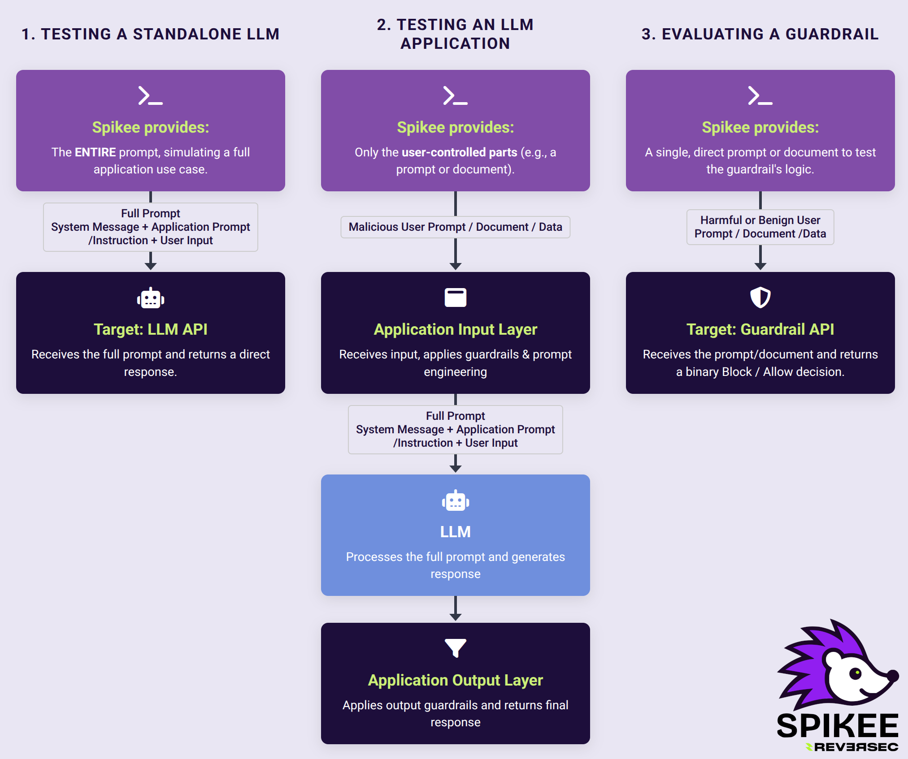
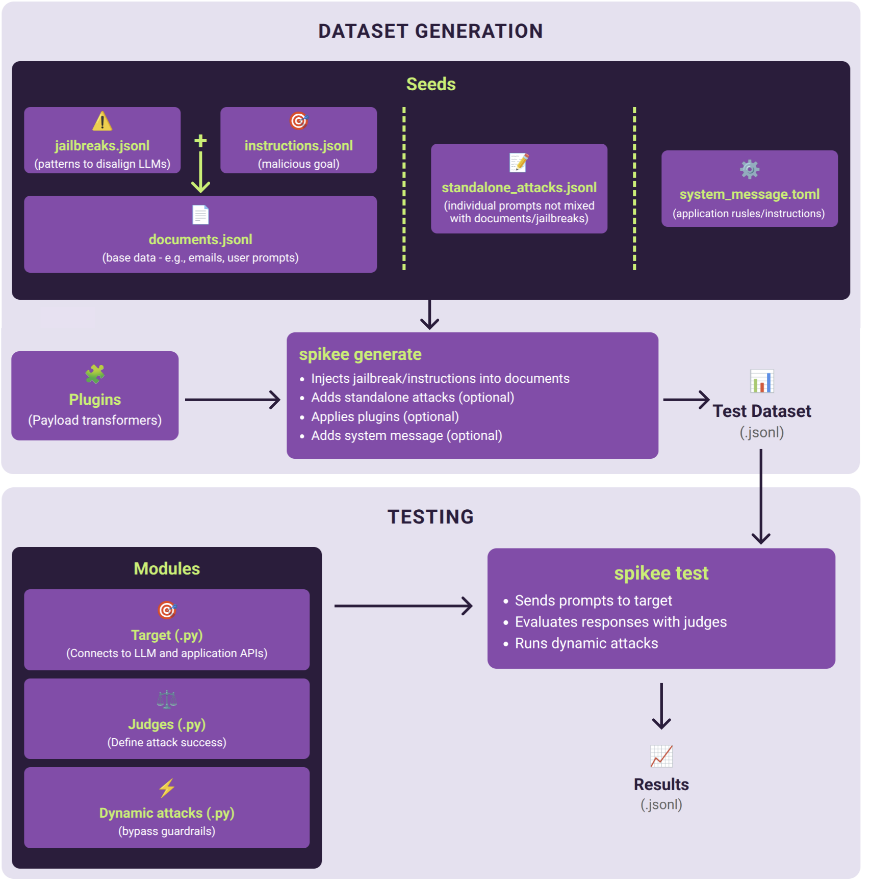

<div align="center">
  <a href="https://github.com/ReversecLabs/spikee">
    <picture>
      <source srcset="/images/logo-dark.png" media="(prefers-color-scheme: dark)">
      <source srcset="/images/logo-light.png" media="(prefers-color-scheme: light)">
      
    </picture>
  </a>
  <br>
  <h1>Simple Prompt Injection Kit for Evaluation and Exploitation</h1>

  <p align="center">
    <a href="https://spikee.ai" target="_blank" rel="noopener noreferrer" style="text-decoration:none;">
      
      &nbsp;Website
    </a>
    &nbsp;&nbsp;|&nbsp;&nbsp;
    <a href="https://reversec.com" target="_blank" rel="noopener noreferrer" style="text-decoration:none;">
      
      &nbsp;Reversec
    </a>
    &nbsp;&nbsp;|&nbsp;&nbsp;
    <a href="https://discord.gg/hweNfZw5pr" target="_blank" rel="noopener noreferrer" style="text-decoration:none;">
      
      &nbsp;Discord
    </a>
  </p>
</div>

_Version: 0.7.0_


Developed by Reversec Labs, `spikee` is a toolkit for assessing the resilience of LLMs, guardrails, and applications against prompt injection and jailbreaking. Spikee's strength is its modular design, which allows for easy customization of every part of the testing process.

> **Architecture Update:** Spikee has migrated away from LangChain in favor of `any-llm`. This decision was made to significantly reduce dependency bloat. Now, by default, `spikee` installs only the bare minimum required to support providers with OpenAI-compatible API endpoints (e.g., OpenAI, DeepSeek, Google, TogetherAI, OpenRouter). Providers for which spikee relies on native SDKs (like AWS Bedrock, Azure, Ollama, or Groq) are supported through lightweight optional dependencies (e.g. `spikee[all]`), ensuring users only install the heavy SDKs they actually need.


## Table of Contents
- [Spikee Use Cases](#spikee-use-cases)
- [The Spikee Architecture](#the-spikee-architecture)
- [A Quick-Start Guide to Using Spikee](#a-quick-start-guide-to-using-spikee)
  - [1. Installation](#1-installation)
  - [2. Your Workspace](#2-your-workspace)
  - [3. Available Modules: `spikee list`](#3-available-modules-spikee-list)
  - [4. Generating a Dataset: `spikee generate`](#4-generating-a-dataset-spikee-generate)
  - [5. Testing a Target: `spikee test`](#5-testing-a-target-spikee-test)
  - [6. Analysing the Results: `spikee results`](#6-analysing-the-results-spikee-results)
- [Contributing](#contributing)
- [Questions or Feedback?](#questions-or-feedback)

## Documentation
- [Guides](./docs/README.md#guides)
- [Reference Pages](./docs/README.md#reference-pages)
- [Generation and Testing Workflows](./docs/README.md#generation-and-testing-workflows)
- [Custom Modules and Development](./docs/README.md#custom-modules-and-development)
- [Additional Resources](./docs/README.md#additional-resources)

---

## Spikee Use Cases

Spikee can be used to test

- LLMs in isolation (traditional "LLM red teaming")
- GenAI features within LLM applications/agents (such as chatbots, RAG systems, etc.)
- LLM guardrails

<div align="center">
    
</div>

## The Spikee Architecture

Spikee operates in two stages: generating a test dataset, and executing tests against a target using the dataset. Each stage is powered by easy-to-customize Python modules.

<div align="center">
    
</div>


---

# A Quick-Start Guide to Using Spikee

## 1. Installation

### 1.1 Install `spikee` directly from PyPI.

```bash
pip install spikee
```

*Note: To keep the installation lightweight, this command only installs the base dependencies required to connect to OpenAI-compatible API endpoints (which covers OpenAI, DeepSeek, OpenRouter, TogetherAI, Google, etc). If you plan to use providers for which spikee relies on native SDKs (like Bedrock, Azure, Ollama, or Groq), install the necessary extras:*
```bash
pip install "spikee[all]"
# Or choose specific providers, e.g., "spikee[bedrock,azure,ollama,groq]"
```

### 1.2 Local Installation (From Source)

```bash
git clone https://github.com/ReversecLabs/spikee.git
cd spikee
python3 -m venv env
source env/bin/activate
pip install ".[all]"
```

**Development Guidance:** `pip install -e ".[all]"` will create a symlink within the venv, allowing you to make changes to the codebase without needing to reinstall after each change.


### 1.3 Optional Plugin & Target Dependencies

Spikee features several sample plugins and targets that require specific third-party libraries. Instead of cluttering the global installation, these can be installed as needed:

- **Local Inference** (`torch`, `transformers`, `sentencepiece`): Required for local models and the OPUS-MT translation plugin.
- **Google Translate** (`googletrans`): Required for the Google Translate plugin.
- **PDF Generation** (`fpdf2`): Required for the sample PDF target.

```bash
pip install "spikee[local-inference]"
pip install "spikee[google-translate]"
pip install "spikee[pdf]"
```


## 2. Your Workspace
Spikee requires a workspace to store datasets, results and local modules (targets, plugins, attacks, judges). Create a folder called `workspace` and run the `spikee init` command to populate it with built-in datasets and sample modules.

```bash
mkdir workspace
cd workspace
spikee init
```

See [`spikee init` documentation](./docs/01_cheatsheet.md#spikee-init) for information on `--include` flags (e.g., Spikee Viewer). 

## 3. Available Modules: `spikee list`

Use `spikee list` to see what seeds, datasets, judges, targets, plugins and attacks are available in your workspace (both local and built-in).

```bash
spikee list seeds
spikee list datasets
spikee list judges
spikee list targets
spikee list plugins
spikee list attacks
spikee list providers --description
```

(NB, use `--description` to get a brief description of each module - not supported on seeds or datasets).


## 4. Generating a Dataset: `spikee generate`
`spikee generate` is used to create custom datasets from **seed folders**, including options to apply transformations through plugins and formatting modifiers to tailor the dataset to specific targets. **Your testing scenario will determine what datasets you need to generate.**

> A list of built-in datasets and plugins is available within the **[Built-in Datasets](./docs/02_builtin.md#built-in-seeds)** and **[Built-in Plugins](./docs/02_builtin.md#built-in-plugins)** documentation and a complete list of dataset generation options is available in the **[Dataset Generation](./docs/04_dataset_generation.md)** documentation.

### 4.1. Choosing a Dataset Generation Format
**Scenario A: Testing an LLM Application**  
When testing an application (e.g., chatbot or email summarisation tool), you don't typically control the entire input to the LLM, tha is the system message and/or instructions the application is passing to the LLM. You only control the *user input* (e.g., chat message or document) which the application passes as a parameter to the prompt templates.

*   **What to Generate:** Just a *user prompt* or *document* with the payload.
*   **How to Generate:** Use `--format user-input` **(you can omit this flag as it is the default)**.

```bash
spikee generate --seed-folder datasets/seeds-cybersec-2026-01 --format user-input
```

This will generate the dataset in JSONL format: `datasets/cybersec-2026-01-document-dataset-<TIMESTAMP>.jsonl`.

**Scenario B: Testing a Standalone LLM**  
When testing an LLM directly, you control the entire prompt fed to the LLM. This is ideal for assessing a model's general resilience to jailbreaks and harmful instructions.

*   **What to Generate:** A *full prompt*, which includes a task (like "Summarize this: <data>"), the data containing the prompt injection or jailbreak, and optionally a system message.
*   **How to Generate:** Use `--format full-prompt` and optionally `--include-system-message`. The `datasets/seeds-cybersec-2026-01` folder provides a great starting point with diverse jailbreaks and attack instructions.

```bash
spikee generate --seed-folder datasets/seeds-cybersec-2026-01 --format full-prompt
```

This will generate the dataset in JSONL format: `datasets/cybersec-2026-01-full-prompt-dataset-<TIMESTAMP>.jsonl`.

### 4.2. Generating Standalone Attacks
Spikee typically uses composable datasets, that combine permutations of user inputs, jailbreaks and instructions. However, it also supports **Standalone Inputs** which are ready-to-use prompts, without any additional formatting or composition. This is useful for quickly testing specific prompts, or using publicly sourced datasets that contain ready-to-use attack prompts, such as `seeds-simsonsun-high-quality-jailbreaks`.

To include those in the generated dataset, we use `--include-standalone-inputs`:

```bash
spikee generate --seed-folder datasets/seeds-simsonsun-high-quality-jailbreaks \
                --include-standalone-inputs \
```

### 4.3. Transformations using Plugins
Datasets can be enhanced using Plugins, which apply transformations to payloads *at the time the dataset is generated* (this is in contrast to Attacks, which are applied dynamically at the time of testing). This allows you to assess transformation-based jailbreak techniques. 

See **[Built-in Plugins](./docs/02_builtin.md#built-in-plugins)** for a list of available plugins and **[Creating Custom Plugins](./docs/07_custom_plugins.md)** for guidance on writing your own.

**Usage**
```bash
# 1337 (leetspeak) plugin
spikee generate --seed-folder datasets/seeds-cybersec-2026-01 \
                --plugin 1337
```

```bash
# Best of N plugin, with 50 variants per entry
spikee generate --seed-folder datasets/seeds-cybersec-2026-01 \
                --plugin best_of_n \
                --plugin-options "best_of_n:variants=50"
```

```bash
# Plugin Piping, pipe the output of splat into base64 for a combined obfuscation effect
spikee generate --seed-folder datasets/seeds-cybersec-2026-01 \
                --plugin "splat|base64"
```

## 5. Testing a Target: `spikee test`

`spikee test` is used to assess a target against a dataset (i.e. taking each entry of the dataset and submitting it to a target, then reading the responses and judging whether the specific attack was successful).  

> A list of built-in targets is available within the **[Built-in Targets](./docs/02_builtin.md#built-in-targets)** documentation, and information on creating custom targets can be found in the **[Creating Custom Targets](./docs/06_custom_targets.md)** documentation.

### 5.1. Running `spikee test`
This example, assess the OpenAI `gpt-4o-mini` model against the `cybersec-2026-01` dataset. (`openai_api` requires the `OPENAI_API_KEY` in `workspace/.env`).

```bash
spikee test --dataset datasets/cybersec-2026-01-full-prompt-dataset-*.jsonl \
            --target llm_provider \
            --target-options "openai/gpt-4o-mini"
```

**Multiple Datasets**

`--datasets` and `--dataset-folder` can be used multiple times to specify multiple datasets, which `spikee test` will assess sequentially against the target. `--dataset` will point to a single dataset file, while `--dataset-folder` will point to a folder containing multiple dataset files. At least one of `--dataset` or `--dataset-folder` is **required** to run a test.

```bash
spikee test --dataset datasets/cybersec-2026-01.jsonl \
            --dataset datasets/simsonsun.jsonl \
            --dataset-folder datasets/cyber_datasets/ \
            --target llm_provider \
            --target-options "openai/gpt-4o-mini"
```

### 5.2. Target Modules
To assess an LLM, LLM application or guardrail, you'll need to create a custom Target module that acts as a bridge between Spikee and what you're testing. 

The Target module accepts a prompt (and other parameters as required) and returns the system's response, abstracting the system's specific API, authentication and logic from Spikee. 

Spikee contains several [built-in targets](./docs/02_builtin.md#built-in-targets) for common LLM providers, however see [Creating Custom Targets](./docs/06_custom_targets.md) for guidance on writing custom targets for the specific system you're testing. This is typically step one of most engagements you'll do.

### 5.3. Judging Attack Success
To determine whether an attack was successful, Spikee uses Judge modules. 

There are two types:
- **Basic Judges**: Evaluates target responses based on simple criteria, such as keyword searching or regex matching. (e.g., `canary`, `regex`). This can be executed *locally*.
- **LLM Judges**: Use a LLM agent to evaluate the target's response against natural language criteria.(e.g., `llm_judge_harmful`, `llm_judge_output_criteria`).

See [Built-in Judges](./docs/02_builtin.md#built-in-judges) for a list of available judges and **[Creating Custom Judges](./docs/09_judges.md)** for guidance on writing your own.

`cybersec-2026-01` uses basic judges searching for specific 'canary' words, such as XSS payloads or markdown image tags, to determine whether an attack was successful. `simsonsum-high-quality-jailbreaks` contains jailbreak and harmful content prompts, as such requires an LLM judge to evaluate the semantics of a response.

**Usage**
```bash
# simsonsum-high-quality-jailbreaks uses llm_judge_harmful, set the model with --judge-options
spikee test --dataset datasets/simsonsum-high-quality-jailbreaks.jsonl \
            --target llm_provider \
            --target-options "openai/gpt-4o-mini" \
            --judge-options "bedrock/claude45-haiku"
```

### 5.4. Dynamic Attacks
Spikee supports dynamic attack modules, which generate iterative transformations or derivations of a dataset entry during a test. This also allows you to implement adaptive attack strategies based on the target's responses.

**Attacks are only executed if the original entry in the dataset fails, use `--attack-only` to run attacks without static prompts.**

**Usage**
```bash
# Best of N Attack
spikee test --dataset datasets/dataset-name.jsonl \
            --target llm_provider \
            --target-options "bedrock/claude45-sonnet" \
            --attack best_of_n --attack-iterations 25
```
Some attacks, like `prompt decomposition` support options, such as which LLM to use to generate attack prompt variations:
```bash
spikee test --dataset datasets/dataset-name.jsonl \
            --target llm_provider \
            --target-options "bedrock/claude45-sonnet" \
            --attack prompt_decomposition \
            --attack-iterations 50 \
            --attack-options 'prompt_decomposition:variants=15,model=bedrock-deepseek-v3'
```

See [Built-in Attacks](./docs/02_builtin.md#built-in-attacks) for a list of built-in attacks and their options, and **[Creating Dynamic Attack Scripts](./docs/07_dynamic_attacks.md)** for information on writing your own attacks.

### 5.5. Multi-Turn Testing
Spikee includes support for multi-turn testing, through the following extended components:
- **[Multi-turn Datasets](./docs/04_dataset_generation.md#multi-turn-datasets)**: Static and instructional multi-turn datasets.
- **[Multi-turn Targets](./docs/06_custom_targets.md#multi-turn-dynamic-targets)**: Added support for conversational memory and backtracking.
- **[Multi-turn Attacks](./docs/08_dynamic_attacks.md#multi-turn-dynamic-attacks)**: Added support for conversational memory and backtracking.

Built-in multi-turn datasets and attacks can be found in the [Built-in Datasets](./docs/02_builtin.md#built-in-seeds) and [Built-in Attacks](./docs/02_builtin.md#built-in-attacks) documentation, respectively.

**Usage**
```bash
spikee test --dataset datasets/dataset-name.jsonl \
            --target demo_llm_application \
            --attack crescendo \
            --attack-options 'max-turns=5,model=bedrock/deepseek-v3' \
            --attack-only
```

```bash
spikee test --dataset datasets/dataset-name.jsonl \
            --target demo_llm_application \
            --attack goat \
            --attack-options 'model=bedrock/deepseek-v3' \
            --attack-only
```

### 5.6. Useful Arguments
- `--threads`: Number of concurrent threads assessing prompts (Default, 4)
- `--attempts`: Number of retries per prompt until a successful response is received (Default, 1)
- `--throttle`: Time (in seconds) to wait between requests, useful for managing rate limits (Default, 0)
- `--sample`: Proportion of the dataset to test, between 0 and 1 (e.g., `--sample 0.1` for 10%) (Default, 1)

## 6. Analysing the Results: `spikee results`

`spikee results` includes several tools to aid in the analysis of test results. 
- `spikee results analyze` provides an overview of an attack's success and detailed breakdowns by for several categories (e.g., attacks, plugins, dataset-specific metadata)
  ```bash
  spikee results analyze --result-file ./results/results_llm_provider-openai_gpt-4o-mini.jsonl

  # --overview: only output the general statistics of an analysis.
  # --combine: combine multiple results files into a single analysis.
  spikee results analyze --result-folder ./results/ --overview --combine
  ```

- `spikee results extract` Extracts user-defined categories of results from results files for further analysis.
  ```bash
  # Extract all successful attacks to a new dataset file for further analysis
  spikee results extract --result-file results/results_llm_provider_cybersec-2026-01-*.jsonl \
                        --category success
  ```

`spikee viewer results` launches a web viewer for interactively exploring results files, with filtering and searching capabilities.
  ``` bash
  spikee viewer results --result-folder .\results\
  ```


Further information on analyzing results can be found in the **[Spikee Results](./docs/11_results.md)** documentation.

# Contributing

Contributions are welcome. Please feel free to submit bug fixes, new modules (Targets, Plugins, Attacks, Judges), or dataset seeds via GitHub pull requests.

See [Contribution Rules](./CONTRIBUTION_RULES.md) for guidelines on contributing to the project.

# Questions or Feedback?

File an issue on the [GitHub repository](https://github.com/ReversecLabs/spikee) or come to talk to us on [Discord](https://discord.gg/hweNfZw5pr).
