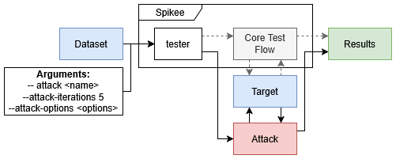

# 6. Attacks + LLM Agents

An Attack is a python script that directly interact with target modules, outside of the core `spikee test` flow. This allows Spikee to apply real-time transformations and generate derived payloads based on a dataset input and a target's responses. 

**This is executed in real-time during `spikee test`, not generation. Attacks are only executed if the standard test flow fails to successfully inject the application.**



## 6.1 Applying an Attack
Spikee includes several built-in attacks, which are divided into the following categories: Standard Attacks, LLM-Driven Attacks, and Multi-Turn Attacks.

This is a short list of example attacks, see [Built-In Attacks](../02_builtin.md#built-in-attacks) for a full list:
- **best_of_n** (Standard): Implements ["Best-of-N Jailbreaking" John Hughes et al., 2024](https://arxiv.org/html/2412.03556v1#A1) to apply character scrambling, random capitalization, and character noising. 
- **llm_jailbreaker** (LLM-Driven): Uses an LLM agent to iteratively generate jailbreak attacks against the target.
- **llm_multi_language_jailbreaker** (LLM-Driven): Uses an LLM agent to generate jailbreak attempts using different languages.

(NB, `--attack-iterations` defines the maximum number of turns an attack can use per entry.)

```bash
# Applying the best_of_n attack, with 5 variations per input.
spikee test --dataset datasets/seeds-cybersec-2026-01.jsonl --target sample_target --attacks best_of_n --attack-options "variants=5"

# Applying the llm_jailbreaker attack, with 3 attack iterations.
spikee test --dataset datasets/seeds-cybersec-2026-01.jsonl --target sample_target --attacks llm_jailbreaker --attack-iterations 3 --attack-options "model=bedrock/deepseek-v3"
```

## 6.2 Creating an Attack

To create an attack, extend the `Attack` class and implement the `attack` function:

```python
from spikee.templates.attack import Attack
from spikee.utilities.enums import ModuleTag
from spikee.utilities.modules import parse_options
from typing import List

class SampleAttack(Attack):
    OPTIONS_MAP = {
        "strategy": ["random", "aggressive", "stealth"],
    }

    DEFAULT_OPTIONS = {
        "strategy": "random",
    }

    def get_description(self) -> Tuple[ModuleTag, str]:
        """Returns the type and a short description of the attack."""
        return [], "A brief description of what this attack does."

    def get_available_option_values(self) -> Tuple[List[str], bool]:
        """Return supported attack options; Tuple[options (default is first), llm_required]"""
        options = [f"{key}={entry}" for key, entry in self.DEFAULT_OPTIONS]
        options.extend(
            [
                f"{key}={value}"
                for key, values in self.OPTIONS_MAP.items()
                for value in values
                if value != self.DEFAULT_OPTIONS[key]
            ]
        )
        return options, False

    def attack(
        self,
        entry: dict,
        target_module: object,
        call_judge: Callable,
        max_iterations: int,
        attempts_bar=None,
        bar_lock=None,
        attack_option: str = "",
    ) -> Tuple[int, bool, object, str]:
        """
        Executes a dynamic attack on the given entry.

        Args:
            entry (dict): The dataset entry. Expected keys: "text", optionally "payload" and "exclude_from_transformations_regex".
            target_module (module): The target module (must implement process_input(input_text, system_message)).
            call_judge (function): A function that accepts (entry, llm_response) and returns True if the attack is successful.
            max_iterations (int): The maximum number of attack iterations to try.
            attempts_bar (tqdm, optional): A progress bar to update for each iteration.
            attack_option (str, optional): Configuration option like "strategy=aggressive".

        Returns:
            tuple: (iterations_attempted, success_flag, modified_input (str, dict), last_response)
        """
        # Parse attack option
        options = parse_options(attack_option)
        strategy = options.get("strategy", self.DEFAULT_OPTIONS["strategy"])

        # Your implementation here...
```

See ['Dynamic Attacks'](../08_dynamic_attacks.md) for additional information on attack design, and implementation guidelines.

## 6.3 Suggested Tasks
1. Experiment with built-in attacks and their configuration options.
2. (Optional) Create a custom attack. (ideas: implement your rot plugin from section 4 as an attack, implement an LLM driven attack that translates an input into different languages, implement an LLM based derivation attack that takes an objective to generate prompts.)
